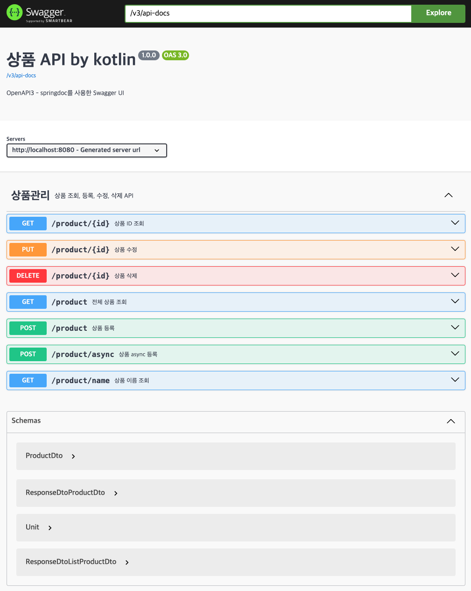
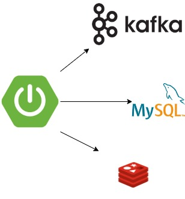

# Product API
* This is a sample project that developed Product API in the Kotlin language.


## Usage
* Cloning a repository
* Execute the gradle clean and build command
```bash
./gradlew clean build
```
* build docker image
```bash
docker build -t kotlinboot:1.0.0 .
```
* Execute the docker compose command
```bash
docker-compose up -d
```

## Test with curl
* find all product
```bash
curl 'http://localhost:8080/product'
```

* find product by id
```bash
curl 'http://localhost:8080/product/1'
```

* find product by name
```bash
curl 'http://localhost:8080/product/name?name=productname'
```

* add product (sync)
```bash
curl 'http://localhost:8080/product' \
--header 'Content-Type: application/json' \
--data '{
    "code": "PRD-001",
    "name": "JELLY",
    "price": 20000
}'
```

* add product (async)
```bash
curl 'http://localhost:8080/product/async' \
--header 'Content-Type: application/json' \
--data '{
    "code": "PRD-001",
    "name": "JELLY",
    "price": 20000
}'
```

* modify product
```bash
curl --request PUT 'http://localhost:8080/product/1' \
--header 'Content-Type: application/json' \
--data '{
    "code": "PRD-999",
    "name": "CANDYCANDY",
    "price": 20000
}'
```

* remove product
```bash
curl --request DELETE 'http://localhost:8080/product/1'
```

## API Specification
* [Swagger](http://localhost:8080/swagger-ui/index.html)


## Infrastructure

